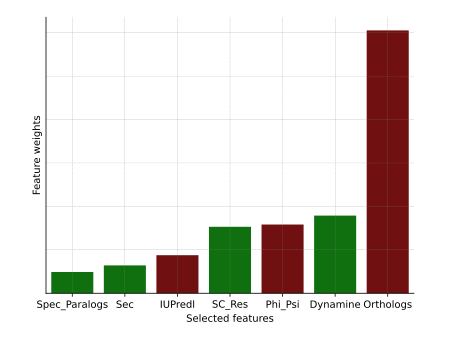
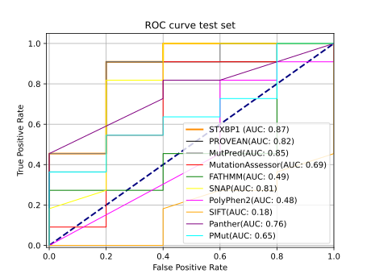

# PRESS: PREdicting <i>[STXBP1](https://www.uniprot.org/uniprot/P61764)</i> (munc18-1) Syndrome

A logreg-based predictor of variant effect in <i>[STXBP1](https://www.uniprot.org/uniprot/P61764)</i>

## webApp
Access the Shiny-based webApp [here](http://shiny.russelllab.org/munc18-1/webApp/) 
## Train set
STXBP1 mutations from the literature (Annemiek & Timon) + [UniProt](https://www.uniprot.org/) + <strong>Xian et al. (2021)</strong>, and tested on 16 lab-validated mutations 
Number of positives (diseased mutations): 97 
Number of negatives (neutral mutations): 120
## Test set
STXBP1 mutations tested on 16 lab-validated mutations 
Number of positives (diseased mutations): 11 
Number of negatives (neutral mutations): 5 
## Feature weights

## ROC curve (test set)

## Performance on train set
| MET           | AUC  | MCC  | F1   | PRE  | REC  | SPE  |
|---------------|------|------|------|------|------|------|
| Avg 5-fold-CV | 0.94 | 0.74 | 0.85 | 0.86 | 0.85 | 0.89 |
| STD           | 0    | 0    | 0    | 0    | 0    | 0    |
## Performance on test set
| Tool             | MCC  | AUC  | F1   | PRE  | REC  | SPE |
|------------------|------|------|------|------|------|-----|
| PRESS            | <strong>0.71</strong> | 0.84 | 0.91 | 0.91 | 0.91 | 0.8 |
| PROVEAN          | 0.15 | 0.82 | 0.8  | 0.71 | 0.91 | 0.2 |
| MutPred          | 0.37 | 0.85 | 0.83 | 0.77 | 0.91 | 0.4 |
| MutationAssessor | 0    | 0.69 | 0.81 | 0.69 | 1    | 0   |
| FATHMM           | 0.25 | 0.49 | 0.31 | 1    | 0.18 | 1   |
| SNAP             | 0.54 | 0.81 | 0.87 | 0.83 | 0.91 | 0.6 |
| PolyPhen2        | 0    | 0.48 | 0.81 | 0.69 | 1    | 0   |
| SIFT             | 0.49 | 0.18 | 0.8  | 0.89 | 0.73 | 0.8 |
## Feature relevance (extracted from the log-reg model)
| Feature   | Relevance | Absolute value |
|-------------|---------|---------|
|BLOSUM   |0.815569 |0.815569|
|Sec      |0.919894 |0.919894|
|Bur      |1.302201 |1.302201|
|rIUPred  |-1.464526|1.464526|
|IUPredl  |-1.500279|1.500279|
|Phi_Psi  |-1.866031|1.866031|
|Paralogs |-2.225684|2.225684|
|Dynamine |2.981365 |2.981365|
|SC_Res   |3.185611 |3.185611|
## Contact
gurdeep.singh[at]bioquant[dot]uni[-]heidelberg[.]de
