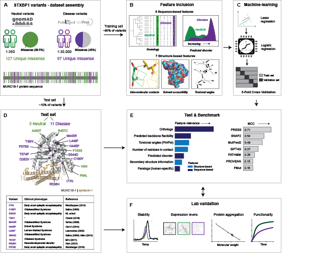

# <strong>PRESS</strong>: <strong>Pre</strong>dicting <i>[<strong>S</strong>TXBP1](https://www.uniprot.org/uniprot/P61764)</i> <strong>s</strong>yndrome

A machine learning-based predictor of variant pathogenicity in <i>[STXBP1](https://www.uniprot.org/uniprot/P61764)</i>

<br>
## Web application
Access the Shiny-based webApp [here](http://press.russelllab.org)<br>
## Workflow
<br>
## Command line
Run the workflow
```
cd scripts/ML
./run.py
```
## Contact
<strong>Gurdeep Singh</strong>: gurdeep.singh@bioquant.uni-heidelberg.de (<a href="russelllab.org">Russell lab</a>, Heidelberg, Germany)<br>
<strong>Annemiek A. van Berkel</strong>: a.a.van.berkel@vu.nl (<a href="https://fga.cncr.nl/people/annemiek_van_berkel">Verhage lab</a>, Amsterdam, Netherlands)<br>
<strong>Timon André</strong>: timon.andre@bzh.uni-heidelberg.de (<a href="https://bzh.db-engine.de/group/52/thomas%20s%C3%B6llner">Söllner lab</a>, Heidelberg, Germany)<br>    
